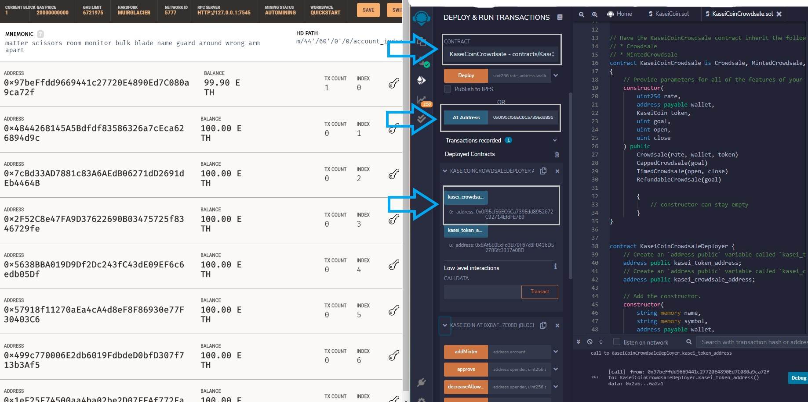

# Token-crowdsale

This project creates a crowd sale for a token called KaseiCoin. 
In order to make this crowd sale I use 3 contracts. The first one creates a token, the second one manage the crowdSale and the last one link both together under a same deployer.

The token is a ERC20 token without any addition specifications. The crowdsale contract determines the rate of exchange from Eth to KAS, which wallet is going to receive the ETH of the transactions, what are the bounderies of the crowdsale (goal, starting date and closing date) and finally a refund in case the target is not reached.
Finally we can find the link between all the previous contracts in the KaseiCoinCrowdsaleDeployer. Those links are made with the contract addresses. In addition this contract remove the deployers right to mint and gives them only to the Crowdsale.

In order to deploy those contract correclty you can follow the steps that follow:

<li> Step 1 : </li>
Compile your KaseiCoin and your CrowdSale contracts. Make sure that your code is correct.  
 

<li> Step 2 : </li>
Before deploying add some accounts from ganache in your Metamask. Import accounts using the keys from ganache.
Make sure that you use a virtual network that is connected to ganche to avoid real fees.  

Then select the environment Injecting Web 3 on Remix. A window will pop up from Metamask to ask you which account you would like to connect to Remix. Select the accounts you just added from ganache. 

<li> Step 3 : </li>
Next you need to deploy the Deployer contract 'KaseiCoinCrowdsaleDeployer'. This deployment will give you two addresses that will be necessary to connect the other contracts.  
 

First of all you should decide of the variables that your token and crowd sale will use: Name, Token symbol,  Wallet to receive the token purchase, goal of the crowd Sale.

Once you have done this and clicked on deploy, Metamask is going to ask you a confirmation and indicate the cost of the deployement. The deployer address will pay these fees when the transaction is confirmed

 
Finally, you will be able to see the deployed contract in Remix and in Ganache (in the transaction tab). The 'KaseiCoinCrowdsaleDeployer' will give you two addressed in Remix in order to make the connection to the other contracts.

<li> Step 4 : </li>
In order to integrate the two remaining contracts, you should pick another contract in the deployer section in Remix and copie and past the corresponding address from the 'KaseiCoinCrowdsaleDeployer'.

Choose the 'KaseiCoin' contract and copie the 'kasei_token_address' into the address space and click on address in the sidebar of remix. This deploys the second contract with the initiation data you decided when deploying 'KaseiCoinCrowdsaleDeployer'. 

 
Choose the 'KaseiCoinCrowdsale' contract and copie the 'kasei_crowdsale_address' into the address space and click on address in the sidebar of remix. This deploys the second contract with the initiation data you decided when deploying 'KaseiCoinCrowdsaleDeployer'. 
 

 

At this stage every thing is deployed and ready to work.

<li> Step 5 : </li>
In addition you can import the KaseiCoin in Metamask. This will allow you to see the token assets for the different accounts. Import the token for every accounts separatly. 

<li> Step 6 : </li>
The crowdSale is launched and you can test the crowd Sale functions with the different connected accounts.